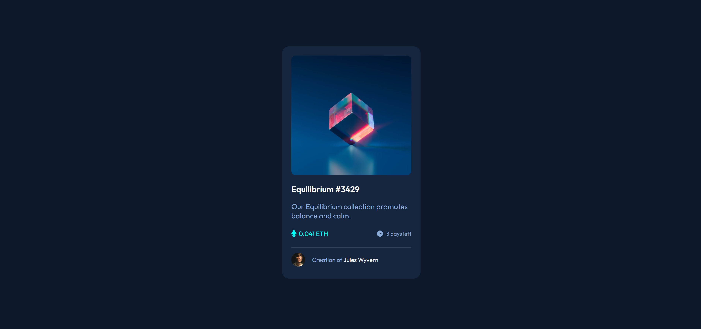

# Frontend Mentor - NFT preview card component solution

This is a solution to the [NFT preview card component challenge on Frontend Mentor](https://www.frontendmentor.io/challenges/nft-preview-card-component-SbdUL_w0U/hub/nft-preview-card-component-egUlzN2Bhl).

## Table of contents

- [Overview](#overview)
  - [The challenge](#the-challenge)
  - [Screenshot](#screenshot)
  - [Links](#links)
- [My process](#my-process)
  - [Built with](#built-with)
- [Author](#author)

### Screenshot

### Links

- Live Site URL: [Live Site at Vercel]()

## My process

### Built with

- Semantic HTML5 markup.
- Flexbox.
- Responsive Design.

## Author

- Github - [Majid-RM](https://github.com/Majid-RM)
- Frontend Mentor - [@Majid-RM](https://www.frontendmentor.io/profile/Majid-RM)
